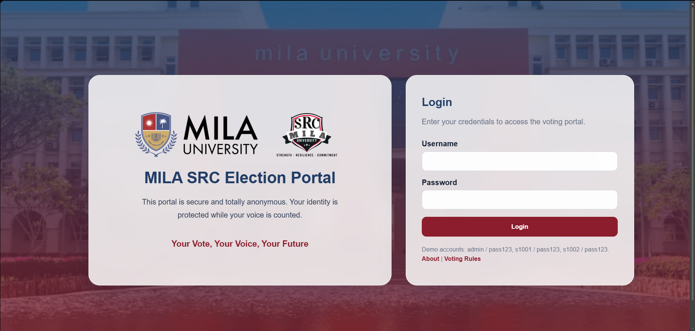

# ECB 4233 - Serve-side Programming Individual Assignment

Name: Son Li Xuan <br>
Student ID: 1106232004

## Project Title
**MILA Student Representative Council (SRC) Election Portal** <br>

This repository contains the MILA University SRC Election Portal built for ECB 4233 Server-side Programming Individual Assignment.


## Project Overview

The application is a Node.js + Express web portal that supports two user roles:

- **Admin**: views election results, candidate standings, and voting participation.
- **Student**: logs in, views candidates, and submits votes for each SRC position.

The portal uses EJS templates for server-side rendering and SQLite for persistent data storage.

## Key Features

- Login system with role-based access for `admin` and student accounts.
- Admin dashboard with live election results, participation stats, and candidate vote bars.
- Student voting page with candidate photos, manifestos, and course details.
- Static image serving from `src-election-portal/images`.
- Seeded database includes voters, users, positions, candidates, and vote constraints.
- Candidate photo path updates and stable seeding using `INSERT OR REPLACE`.
- Branded UI using MILA logo colors and thematic page styling.
- Additional features: `About` and `Voting Rules` in Login Page

## Project Structure

- `src-election-portal/server.js` - main Express app and route handling.
- `src-election-portal/database.js` - SQLite schema creation, seed data, and migrations.
- `src-election-portal/views/` - EJS templates for landing, admin, and student pages.
- `src-election-portal/images/` - image assets used by the portal.
- `src-election-portal/package.json` - app metadata, dependencies, and scripts.

## Running the App

1. Open a terminal and navigate into the app folder:
   ```bash
   cd src-election-portal
   ```
2. Install dependencies:
   ```bash
   npm install
   ```
3. Create a `.env` file with a session secret:
   ```bash
   echo "SESSION_SECRET=yourSecretHere" > .env
   ```
4. Start the server:
   ```bash
   npm start
   ```

The app listens on `http://localhost:3000`.

## Default Accounts for Demonstration

- Admin: `admin` / `pass123`
- Student accounts: `s1001` through `s1007`, all using `pass123`

## Sample Screenchots of Output
1. Login page (index.ejs) <br>



2. Admin Dashboard <br>


3. Student Dashboard - Before Voting <br>


4. Student Dashboard - After Voting <br>


## Notes

- The database file is `src-election-portal/school.db`.
- Candidate images are referenced from the `images` directory and served at `/images/<filename>`.
- Port `3000` must be free before starting the server.
