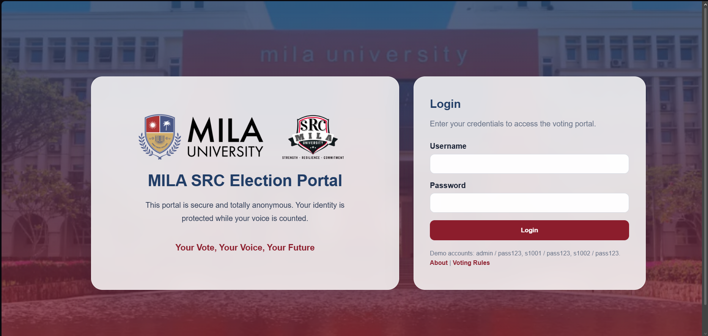
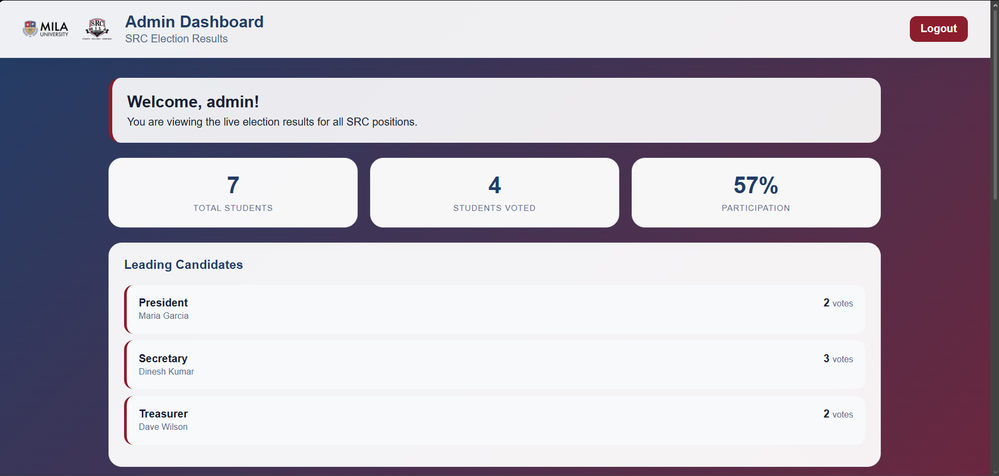
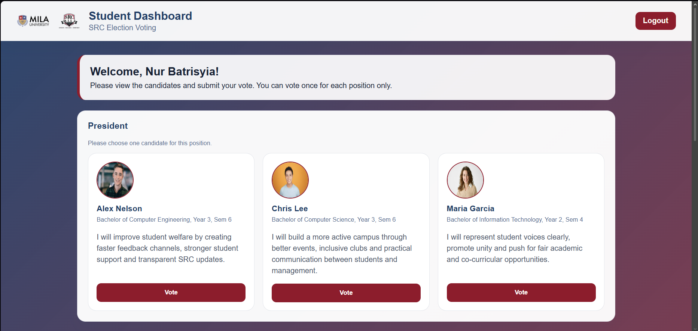

# ECB 4233 Serversdie Programming - Individual Assignment

Name: Son Li Xuan  
Student ID: 1106232004
## Project Title
MILA University Student Representative Council (SRC) Election Portal

## Project Description
This is a full-stack web application for the MILA University SRC election. The system allows an admin to view live election results and allows students to log in, view candidate names and manifestos, and vote only once for each election position.


## Features Included
- Role-based login for Admin and Students.
- Admin dashboard to view live election results.
- Student dashboard to view candidates, manifestos and vote.
- Students can vote only once for each position.
- MILA University and SRC logos included in the interface.
- Personalized welcome message after login.
- Additional voters and candidates seeded in the database.
- Profile images for candidates.
- Multiple election positions: President, Secretary, and Treasurer.
- Security enhancements using sessions, bcrypt password hashing, role checking, duplicate vote checking and `.gitignore` protection.
- Two extra informational routes: `/about` and `/rules`.

## Login Accounts
All passwords are `pass123`.

| Role | Username | Password |
|---|---|---|
| Admin | admin | pass123 |
| Student | s1001 | pass123 |
| Student | s1002 | pass123 |
| Student | s1003 | pass123 |
| Student | s1004 | pass123 |
| Student | s1005 | pass123 |
| Student | s1006 | pass123 |

## File Structure

```text
src-election-portal/
├── database.js
├── server.js
├── package.json
├── .env
├── .gitignore
├── images
└── views/
    ├── index.ejs
    ├── admin.ejs
    └── student.ejs
```

## Sample Screenshots of Output
The screenshots below are stored in the images folder:

### Login Page


### Admin Dashboard


### Student Dashboard


## Notes
- Do not push `node_modules`, `.env` or `school.db` to GitHub.
- If the database structure does not update, delete `school.db` and run the server again.
